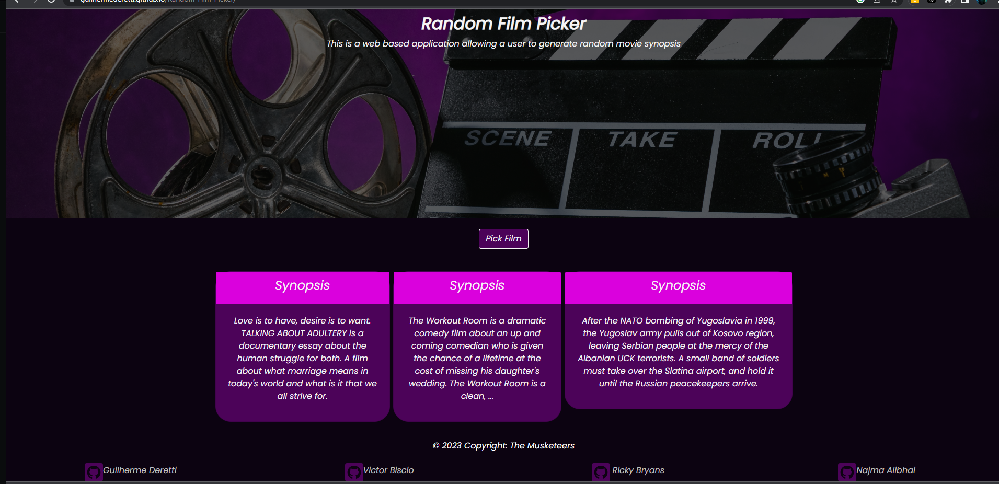

# Random Film Picker

This application provides a convenient and efficient way for movie enthusiasts to discover new films. Users can view synopses of three random movies at a time, and upon selecting one, they will be presented with more in-depth information including the movie's cover, streaming availability, and a detailed description of the plot. The application is designed to be user-friendly, and an intuitive search bar allows users to find specific movies they are interested in.

# Application Requirements

* Create a real-world front-end application that you’ll be able to showcase to potential employers. 
* Use Bootstrap.
* Be interactive (in other words, accept and respond to user input).
* Use at least two server-side APIs Links to an external site..
* Use modals instead of alerts, confirms, or prompts.
* Use client-side storage to store persistent data.
* Be responsive.
* Have a polished UI.

# User Story

As a movie lover, I want to have an easy and efficient way to discover new films. I want to see short summaries of different movies so that I can quickly decide which ones I may want to watch. When I see a movie summary that interests me, I want to be able to see more information about it, including its cover, streaming availability, and a detailed plot description.

# Technologies Used

Js Query: Used for DOM manipulation and handling events
Ajax: Used for making API calls to retrieve movie data asynchronously
Bootstrap 4: Used for styling and responsive layout
CSS: Used for custom styling to enhance user interface

# The Two API used are:

[OTT](https://rapidapi.com/gox-ai-gox-ai-default/api/ott-details)

[Watch Mode](https://watchmode.p.rapidapi.com)

# Getting Started

### Step 1

Registration for an API key in order to use this API.

### Step 2

New repository was created by Guilherme Deretti on his account and the rest of the team members clone it to their computer using git clone command.

### Step 3

Created index.html file, script file and style css file were created and push up

### Step 4

General duties were breakdown and each member were assigned part of the duties. Each of the member worked on the branch and later pull merge request were created. 

# Current look of the project

# Links to the project

[Deployment Link](https://guilhermederetti.github.io/Random-Film-Picker/)

[Github Link](https://guilhermederetti.github.io/Random-Film-Picker/)

# Team Members:

* Guilherme Deretti
* Victor Biscio
* Ricky Bryans
* Najma Alibhai

# Challenges

* Main challenge was to find API that worked well together. Our original idea was to look up continents and pick random city and then produce meal and recipe of that country.
* API quota running out
* Github conflicts.

# Success

* Managed to work as a team during project hours and outside of those hours
* Had fun overall
* Able to produce MVP required given the time frame

# Conclusion

This project has given us confidence in building app from scratch and working within team environment. We believe it has future potential in linking with other apps or using other api and showing which cities the movie is playing in. 
    

