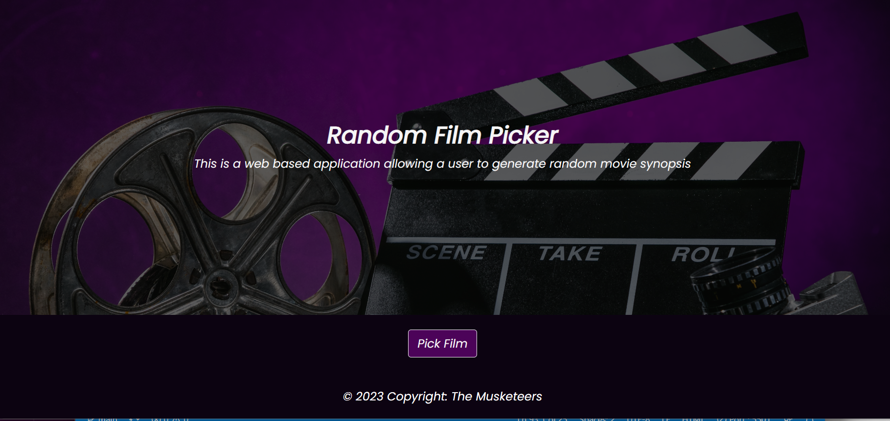
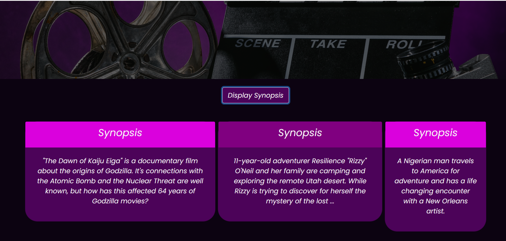
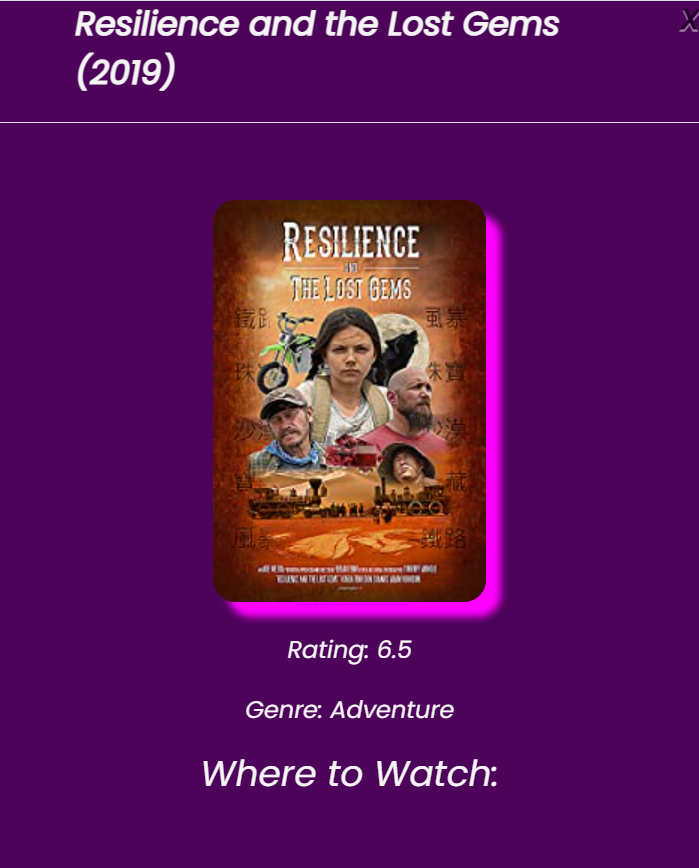

# Random Film Picker

Random Film Picker is an app that solves the problem of boredom and conflict among friends and family on choice of movie. It randomly picks up a movie synopsis which further relates to the title of the movie, rating and the year of release.
The project was made using HTML, CSS and Javascript using two server API and making them coexist together. 

# Application Requirements

    * create a real-world front-end application that you’ll be able to showcase to potential employers. 

    * Use Bootstrap.

    * Be interactive (in other words, accept and respond to user input).

    * Use at least two server-side APIs Links to an external site..

    * Use modals instead of alerts, confirms, or prompts.

    * Use client-side storage to store persistent data.

    * Be responsive.

    * Have a polished UI.

# THe Two API used are:

    * [OTT](https://rapidapi.com/gox-ai-gox-ai-default/api/ott-details)

    *  [Watch Mode](https://watchmode.p.rapidapi.com)

# Concept
This project is a web-based application that allows users to generate and view random film synopsis. Upon clicking the Pick Film button, a random synopsis is generated. To view more about this film, click on synopsis and everything about the film will be displayed in the modal format.

 # Getting Started

Step 1

Registration for an API key in order to use this API.

Step 2

New repository was created by Guilherme Deretti on his account and the rest of the team members clone it to their computer using git clone command.

Step 3

Created index.html file, script file and style css file were created and push up

Step 4

General duties were breakdown and each member were assigned part of the duties. Each of the member worked on the branch and later pull merge request were created. 

# Current look of the project

    * 

    * 

    * 

# Links to the project

    * [Deployment Link](https://guilhermederetti.github.io/Random-Film-Picker/)

    * [Github Link](https://guilhermederetti.github.io/Random-Film-Picker/)

# Team Members:

        * Guilherme Deretti
        * Victor Biscio
        * Ricky Bryans
        * Najma Alibhai

# Challenges

    * Main challenge was to find API that worked well together. Our original idea was to look up continents and pick random city and then produce meal and recipe of that country.

    * API quota running out

    * Github conflicts.

# Success

    * Managed to work as a team during project hours and outside of those hours

    * Had fun overall

    * Able to produce MVP required given the time frame

# Conclusion

    This project has given us confidence in building app from scratch and working within team environment. We believe it has future potential in linking with other apps or using other api and showing which cities the movie is playing in. 
    

